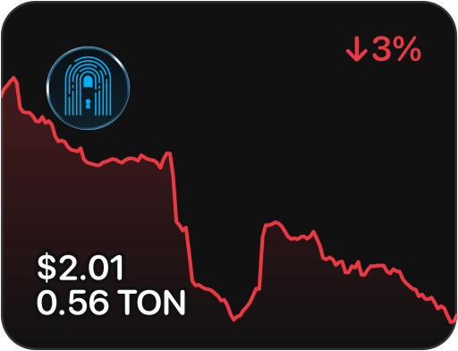
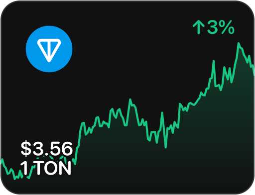
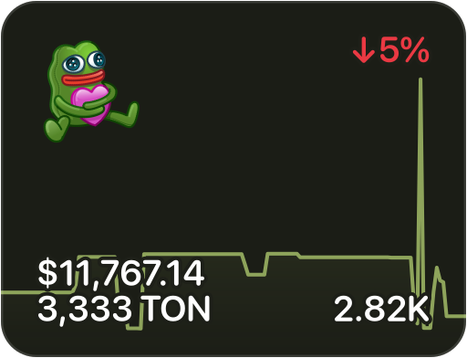
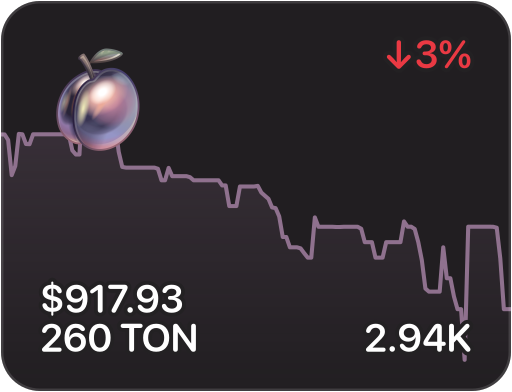
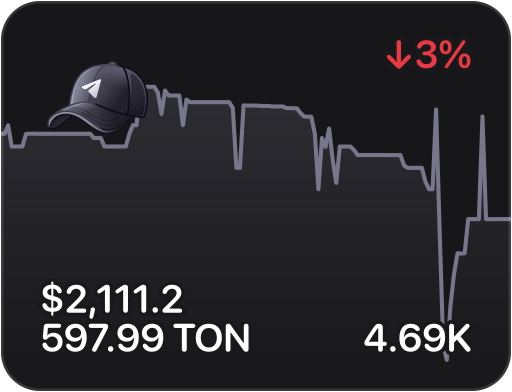
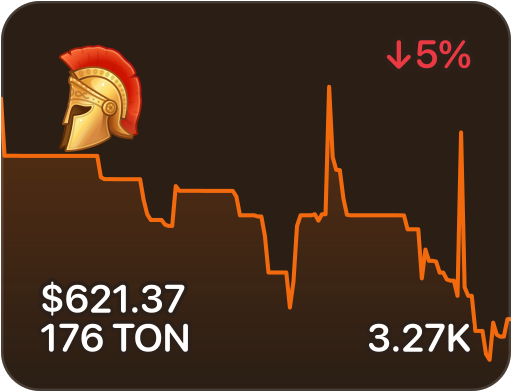
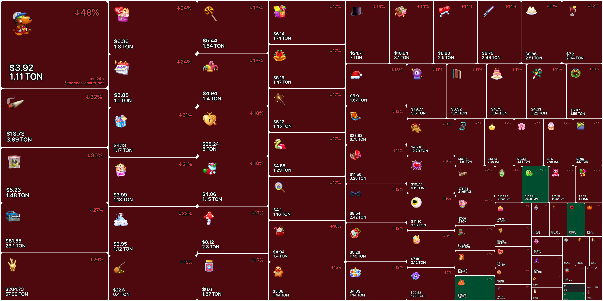

# Showcase

<table>
  <tr>
    <td>
      
      
      
    </td>
  </tr>
  <tr>
    <td>
      
      
      
    </td>
  </tr>
  <tr>
    <td>
      
    </td>
  </tr>
</table>

# Structure

```
gifts/
├── marketcap/
│   ├── daily.json
│   ├── weekly.json
│   └── ...
├── heatmaps/
│   ├── change-24h-ton.png
│   ├── change-24h-usd.png
│   ├── change-1w-ton.png
│   ├── change-1w-usd.png
│   ├── marketcap-24h-ton.png
│   ├── marketcap-24h-usd.png
│   ├── marketcap-1w-ton.png
│   ├── marketcap-1w-usd.png
│   └── ...
├── charts/
│   ├── webp/
│   │   └── plushpepe.webp
│   ├── svg/
│   │   └── 1w/
│   │       ├── plushpepe-ton.svg
│   │       ├── plushpepe-usd.svg
│   │       └── ...
│   ├── plushpepe/
│   │       ├── daily.json
│   │       ├── weekly.json
│   │       └── ...
│   └── ...
└── ...
```
