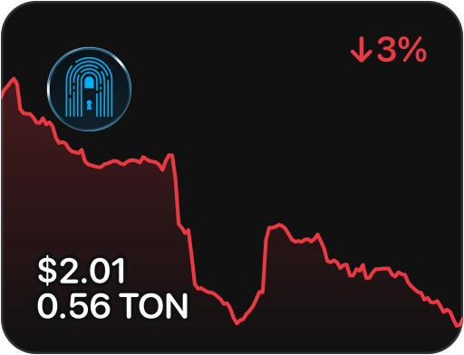
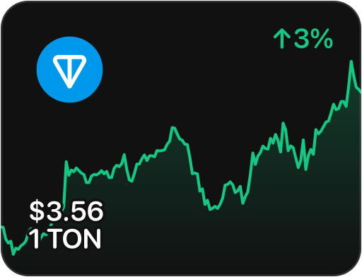
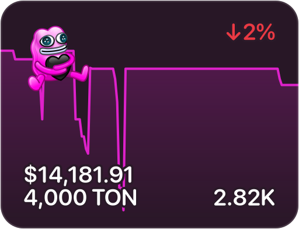
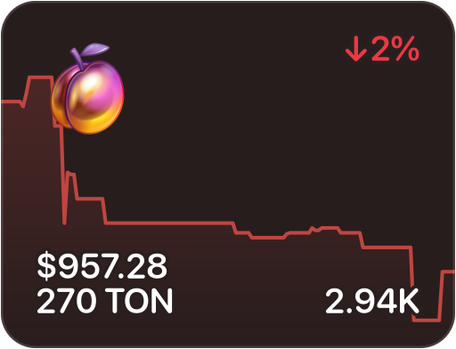
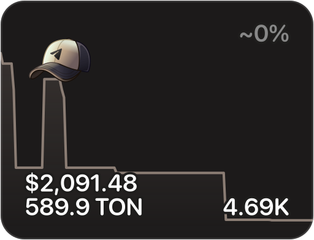
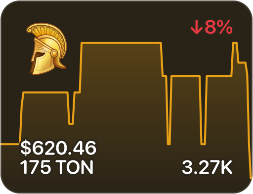
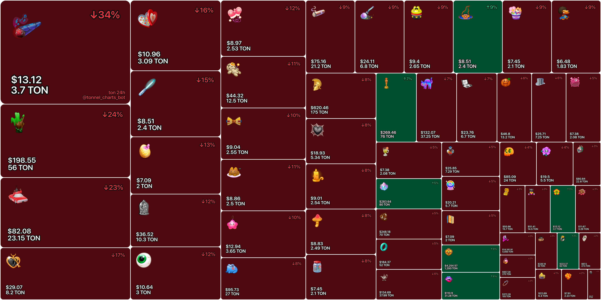

<table>
  <tr>
    <td>
      
      
      
    </td>
  </tr>
  <tr>
    <td>
      
      
      
    </td>
  </tr>
  <tr>
    <td>
      
    </td>
  </tr>
</table>

<table>
  <tr>
    <td>
      
      
      
    </td>
  </tr>
  <tr>
    <td>
      
      
      
    </td>
  </tr>
  <tr>
    <td>
      
    </td>
  </tr>
</table>
